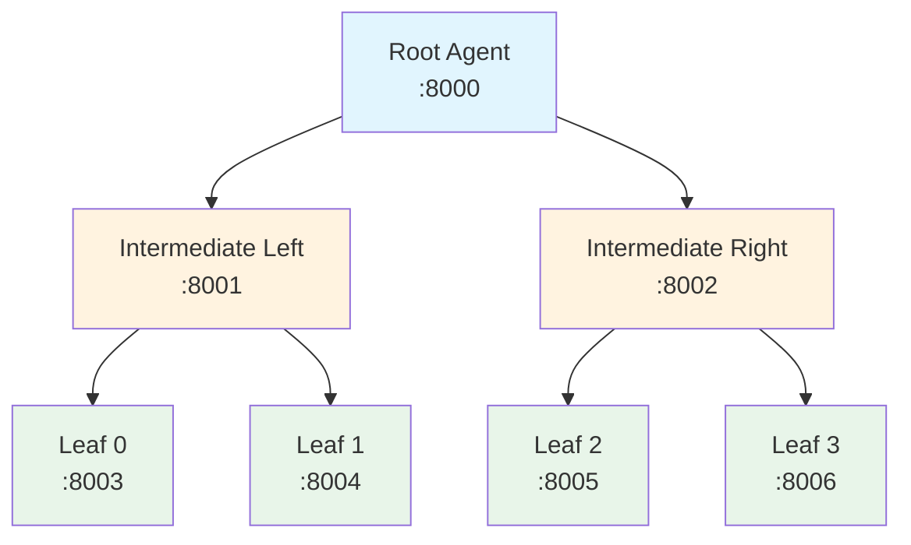
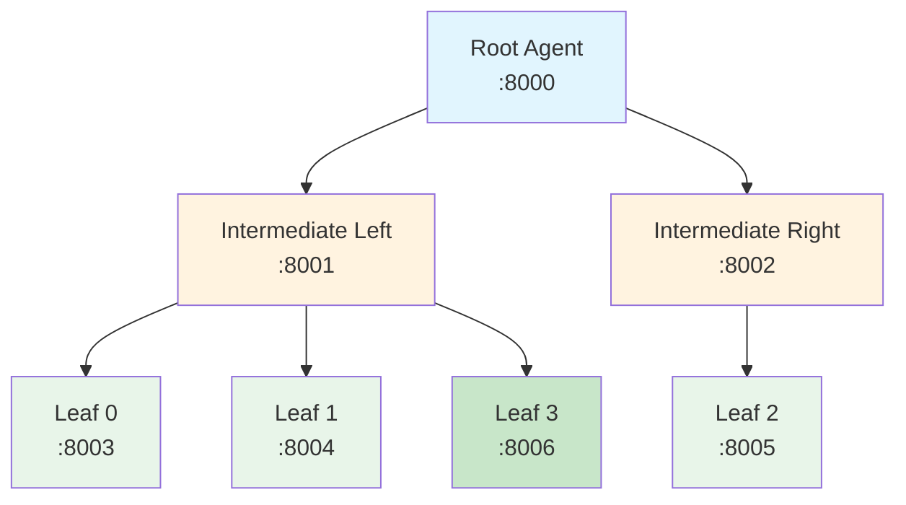

# Multi-Agent Binary Tree System

A Python-based multi-agent system structured as a binary tree with 3 levels. Each agent runs as an independent FastAPI HTTP server.

## Architecture

### Network Diagram (Initial State)



### Network Diagram (After Load Balancing)

When one intermediate processes significantly more tokens, a leaf is moved to balance the load:



### Text Diagram

```
Level 1 (Root):
                    ┌─────────────────┐
                    │   Root Agent    │
                    │   port: 8000    │
                    └────────┬────────┘
                             │
            ┌────────────────┴────────────────┐
            │                                 │
            ▼                                 ▼
Level 2 (Intermediate):
   ┌─────────────────┐               ┌─────────────────┐
   │ Intermediate    │               │ Intermediate    │
   │ Left (:8001)    │               │ Right (:8002)   │
   └────────┬────────┘               └────────┬────────┘
            │                                 │
      ┌─────┴─────┐                     ┌─────┴─────┐
      │           │                     │           │
      ▼           ▼                     ▼           ▼
Level 3 (Leaf):
 ┌─────────┐ ┌─────────┐           ┌─────────┐ ┌─────────┐
 │ Leaf 0  │ │ Leaf 1  │           │ Leaf 2  │ │ Leaf 3  │
 │ (:8003) │ │ (:8004) │           │ (:8005) │ │ (:8006) │
 └─────────┘ └─────────┘           └─────────┘ └─────────┘
```

## Features

- **Hierarchical Task Processing**: Tasks flow from root to leaves and results aggregate back up
- **Health Monitoring**: `/health` endpoint on all agents
- **Dynamic Load Balancing**: Automatic redistribution of leaf agents based on token processing load
- **Modular Design**: Each agent type is a separate, extensible module

## Quick Start

### 1. Launch All Agents

```bash
./launch_agents.sh
```

This will:
- Create a virtual environment
- Install dependencies
- Start all 7 agents
- Show their URLs

### 2. Run Tests

```bash
./test_system.sh
```

### 3. Stop All Agents

```bash
./stop_agents.sh
```

Or press `Ctrl+C` in the launch terminal.

## API Endpoints

### Root Agent (port 8000)

| Endpoint | Method | Description |
|----------|--------|-------------|
| `/task` | POST | Submit a task for processing |
| `/health` | GET | Health check |
| `/stats` | GET | Get statistics and tree structure |
| `/rebalance` | POST | Trigger load balancing |
| `/set_threshold` | POST | Set load balance threshold |

### Intermediate Agents (ports 8001, 8002)

| Endpoint | Method | Description |
|----------|--------|-------------|
| `/task` | POST | Process task (forwards to leaves) |
| `/health` | GET | Health check |
| `/stats` | GET | Get statistics |
| `/update_children` | POST | Update child leaf assignments |

### Leaf Agents (ports 8003-8006)

| Endpoint | Method | Description |
|----------|--------|-------------|
| `/task` | POST | Process task (simulates work) |
| `/health` | GET | Health check |
| `/stats` | GET | Get statistics |

## Example curl Commands

### Health Checks

```bash
# Check root health
curl http://localhost:8000/health

# Check all agents
for port in 8000 8001 8002 8003 8004 8005 8006; do
  echo "Port $port:"
  curl -s http://localhost:$port/health | python3 -m json.tool
done
```

### Submit Tasks

```bash
# Submit a single task
curl -X POST http://localhost:8000/task \
  -H "Content-Type: application/json" \
  -d '{"task_id": "task-001", "description": "Process data", "data": {"key": "value"}}'

# Submit multiple tasks
for i in {1..10}; do
  curl -X POST http://localhost:8000/task \
    -H "Content-Type: application/json" \
    -d "{\"task_id\": \"task-$i\", \"description\": \"Task $i\"}"
done
```

### Check Statistics

```bash
# Root stats (includes tree structure and token distribution)
curl http://localhost:8000/stats | python3 -m json.tool

# Intermediate stats
curl http://localhost:8001/stats | python3 -m json.tool
curl http://localhost:8002/stats | python3 -m json.tool

# Leaf stats
curl http://localhost:8003/stats | python3 -m json.tool
```

### Load Balancing

```bash
# Trigger manual rebalancing check
curl -X POST http://localhost:8000/rebalance | python3 -m json.tool

# Set rebalancing threshold (0.0 to 1.0)
curl -X POST "http://localhost:8000/set_threshold?threshold=0.2"

# Manually update intermediate children
curl -X POST http://localhost:8001/update_children \
  -H "Content-Type: application/json" \
  -d '{"new_children": ["leaf_0", "leaf_1", "leaf_2"]}'
```

## Load Balancing Logic

The root agent monitors token processing across intermediate agents. When the imbalance exceeds the threshold (default 30%):

1. Identifies the heavier and lighter intermediate
2. Moves one leaf from heavier to lighter
3. Updates both intermediates via `/update_children`
4. Resets token counters

## Project Structure

```
.
├── config.py              # Port assignments and tree structure
├── models.py              # Pydantic data models
├── leaf_agent.py          # Level 3 agents
├── intermediate_agent.py  # Level 2 agents
├── root_agent.py          # Level 1 agent
├── launch_agents.sh       # Start all agents
├── stop_agents.sh         # Stop all agents
├── test_system.sh         # Test script
├── requirements.txt       # Python dependencies
└── logs/                  # Agent log files
```

## Extending the System

### Adding New Agent Types

1. Create a new agent file following the pattern in `leaf_agent.py`
2. Add port configuration in `config.py`
3. Update `launch_agents.sh` to start the new agent

### Adding New Endpoints

Each agent's `create_app()` function uses FastAPI. Add new routes there:

```python
@app.get("/custom_endpoint")
async def custom_handler():
    return {"result": "custom data"}
```

### Modifying Load Balancing

Edit `RootAgent.check_and_rebalance()` in `root_agent.py` to implement custom balancing logic.
